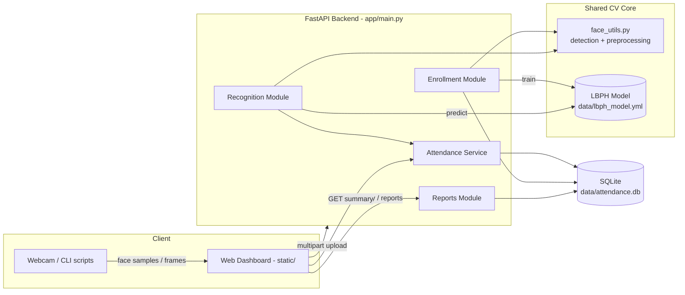
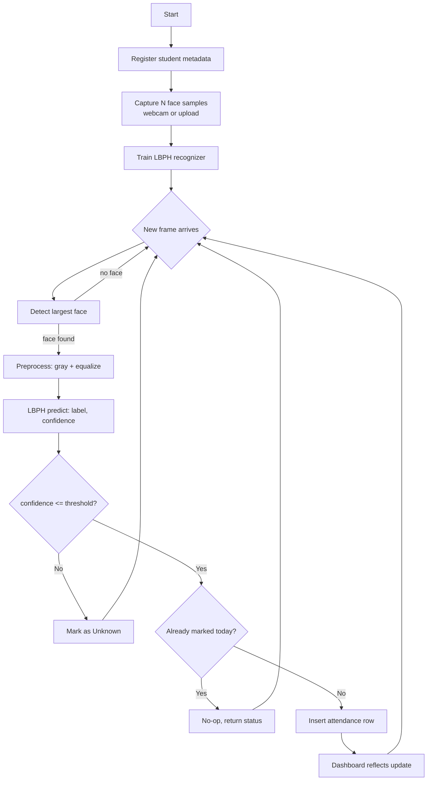
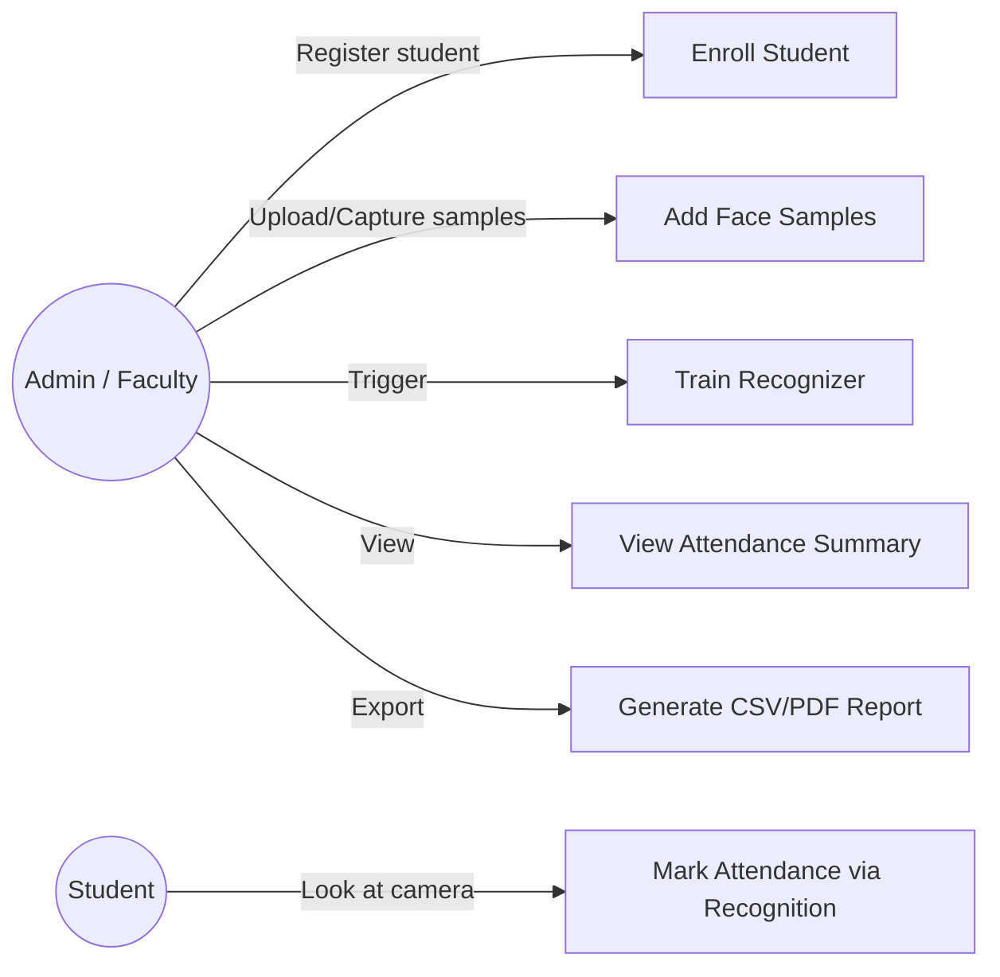
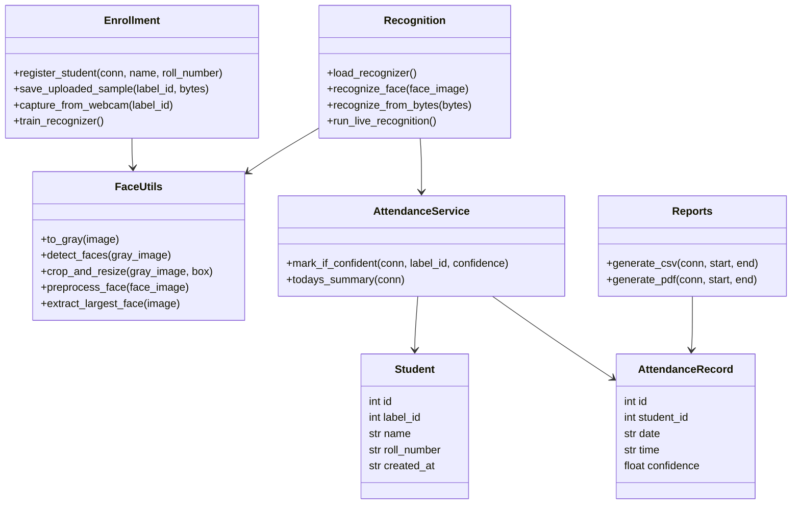
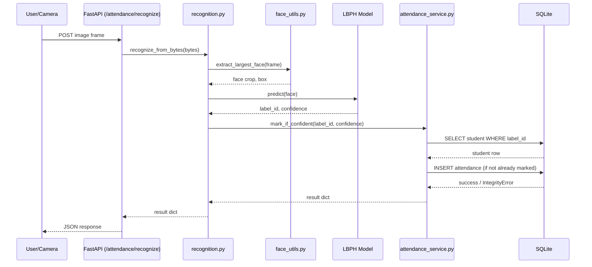
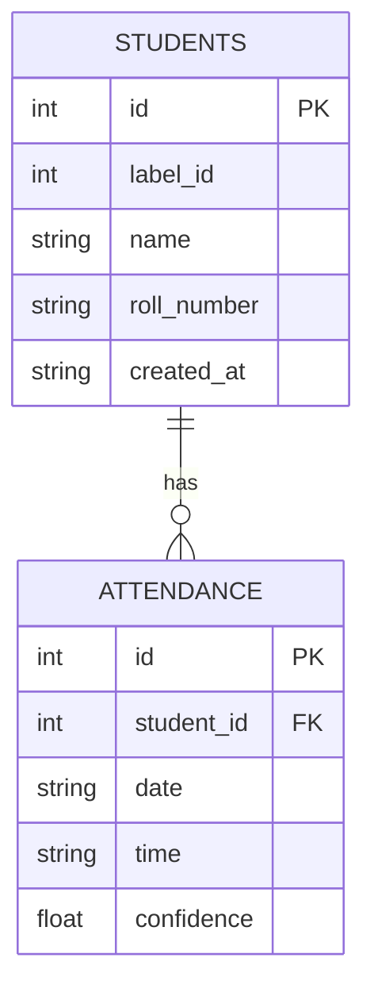

# System Design & Diagrams

All diagrams below are written in Mermaid and render automatically when
viewed on GitHub.

## 1. System Architecture

## 2. Process / Workflow Diagram

## 3. Use Case Diagram

## 4. Class Diagram

## 5. Sequence Diagram — Recognition & Attendance Marking

## 6. ER Diagram

